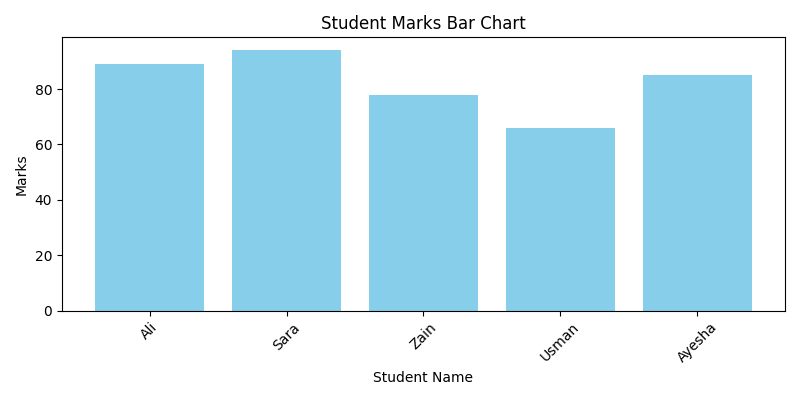

# 📚 Student Marks Analysis using Python & Pandas

This beginner-friendly data analysis project reads student marks from a CSV file, filters high scoring students, performs basic statistics, and visualizes the results using Python libraries.

📌 **Skills Demonstrated:**
- Reading and filtering data using **Pandas**
- Calculating average and maximum marks
- Writing filtered data to a new CSV file
- Creating a **bar chart visualization** using **Matplotlib**
- Saving analysis results

---

## 📂 Project Files

| File | Description |
|------|-------------|
| `student.csv` | Original dataset of student names and their marks |
| `marks_analysis.ipynb` | Jupyter Notebook with full analysis code |
| `high_scorers.csv` | Filtered data of students who scored above 80 |
| `marks_chart.png` | Visualization of marks using a bar chart |
| `README.md` | This file explaining the entire project |

---

## 📈 Output Screenshot



---

## 💡 Features Covered

- ✅ Read CSV file using `pandas`
- ✅ Calculate average and highest marks
- ✅ Filter students with marks > 80
- ✅ Save filtered data into a new CSV
- ✅ Create a bar chart of all student marks
- ✅ Clean, well-documented Jupyter notebook

---

## 🔍 Sample Code Output

```python
Total students: 10
Average marks: 78.6
High Scorers:
     name  marks
2   Ayesha     91
5     Zain     85
9    Saira     89

🔧 Tech Stack
Python 3

Pandas

Matplotlib

Jupyter Notebook

👨‍💻 Author
Yasir Ali
Aspiring Data Scientist | HSC CS Student
GitHub: github.com/yasirali-datasci

🏷️ Tags
#python #pandas #matplotlib #csv #data-analysis #student-marks
#jupyter-notebook #beginner-project #yasirali #datascience-project
